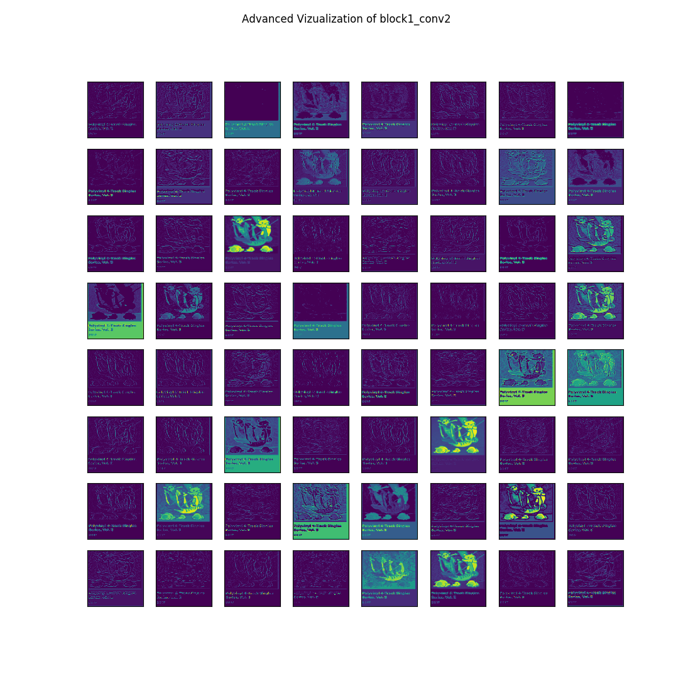
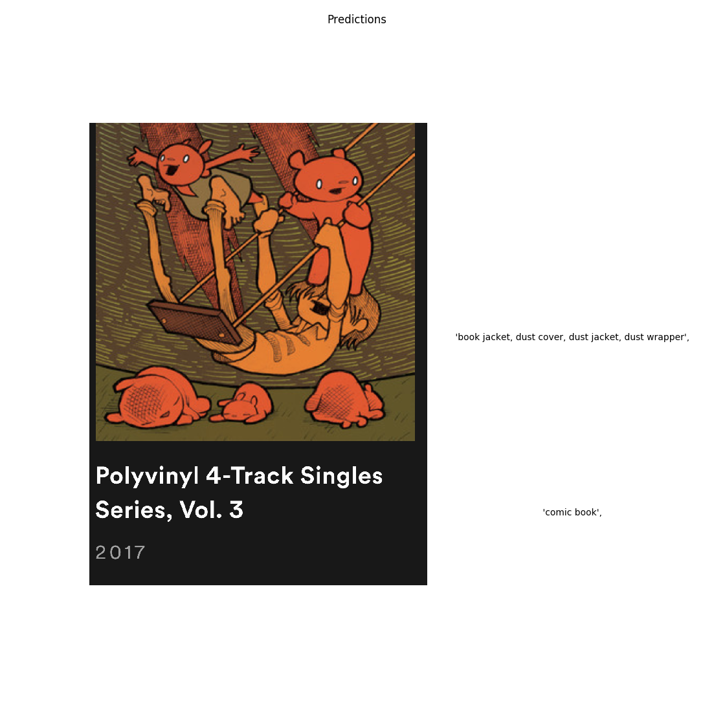

<h1>Filter Visualization</h1>

    This program was built following
     <a href="https://towardsdatascience.com/visualising-filters-and-feature-maps-for-deep-learning-d814e13bd671">Towards Data Science</a>.

    The purpose of this program is to break out what's going
    on inside of a neural network a little bit. For each
    convolutional layer in a neural network we know
    that there are a set of filter being trained. Those
    are the weights being trained in that neuron.
    For this project we use a pre-trained VGG network
    architecture and test it on a few images. Using the program
    we are able to select any of the convolutional layers
    via command line arguments at the prompt and view
    what the network is "seeing for that layer".

    Here are some examples of the program in action. Each of
    these was run on the second conv layer with 8 rows of
    8 filters plotted. This number is changeable based on the
    network being implemented by the user. For VGG's second
    convolutional layer 64 filters represents all of the filters
    being trained.

