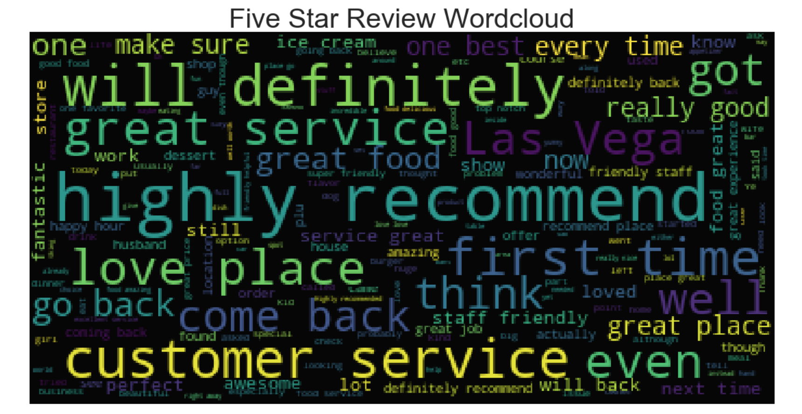
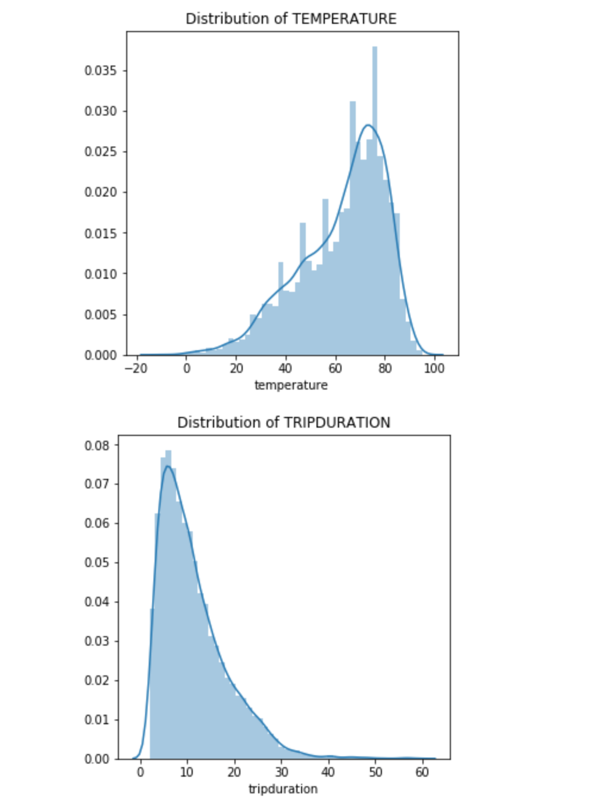
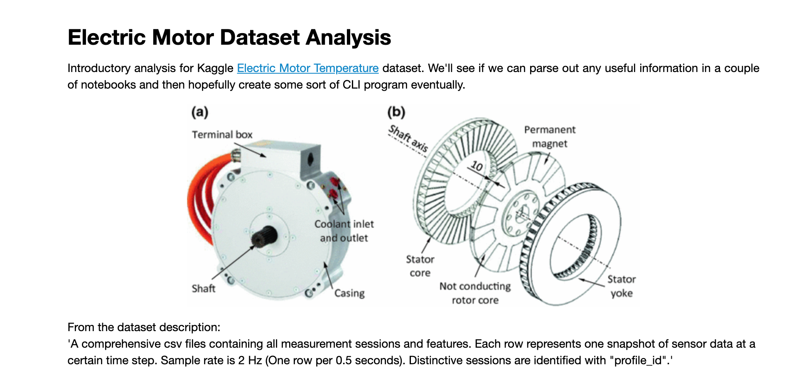

<h1> Kaggle Competition Projects </h1>

Location to store any kaggle competition projects that I work on. Kaggle competitions have been a great way for me to exercise data science practices along with machine learning and deep learning on real data. The competitions are mostly for fun and I personally enjoy creating tools for navigating/gaining insights into datasets, but they're a blast to work on.

    TODO: Description of significant findings.

<h3> Yelp </h3>

<h3> Divvy </h3>

<h3> Electric Motors </h3>

